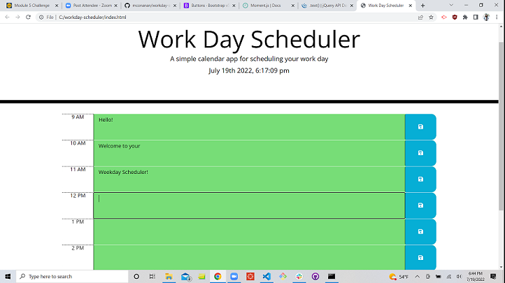

# workday-scheduler
Module 5 challenge; create an interactive workday scheduler.

When page is opened, user is greeted with a jumptron displaying purpose of the page and title, "Weekday Scheduler." Displayed beneath are the current date and time using the moment library.

There is a table of rows for each working hour, 9am-5pm. There is a text input area, and an icon of a floppy disk to save the data.

A checkHour function was created so that the current hour is displayed in gray, hours previous are displayed in red, and upcoming hours are displayed in green. This is done by using an if else statemnent to add and remove bootstrap classes and comparing the current hour to the id of the table row. The id is split into two different strings, and the index [1] is used to grab the integer of the id (the time).

A click event on the save icon of each row runs a function called storeInput, which saves the text input of the rows to local storage using setItem. getItem methods on each row are used so that when the page is reloaded, the information in the forms persists.

deployed webpage: https://mconanan.github.io/workday-scheduler/
github repository: https://github.com/mconanan/workday-scheduler